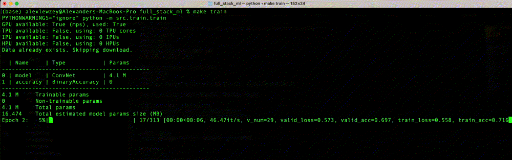

# Full Stack ML

A full-stack machine learning project that classifies images as either a cat or a dog. This project showcases a complete ML pipeline from model training to production deployment, along with best practices in software engineering and DevOps.

## UI Example


## Train Example



## Features

- CLI scripts to train image classification models (cat or dog)
- Experiment tracking and model repository
- Web UI for users to upload images and view predictions
- Serverless architecture using AWS Lambda for cost-effective scaling
- Infrastructure as Code (IaC) with AWS CDK for reproducible deployments
- CI/CD pipeline for automated testing and deployment to staging and prod environments
- Monitoring of deployment, UI traffic etc
- Comprehensive test suite including unit tests and end-to-end tests
- Best practices in code quality and dependency management

## Tech Stack

- **Machine Learning**: PyTorch, PyTorch Lightning, MLflow
- **API/UI**: FastAPI, Mangum
- **Infrastructure**: AWS (Lambda, ERC, ApiGateway), AWS CDK (Python)
- **Containerization**: Docker
- **Testing**: pytest
- **Code Quality**: ruff, mypy
- **Dependency Management**: Poetry, devcontainer
- **CI/CD**: GitHub Actions
- **Monitoring**: CloudWatch


## Project Structure

```plaintext
├── README.md
├── cdk.json
├── images
│   ├── cat_0.jpg
│   ├── dog_0.png
│   ├── sample
│   │   └── data
│   └── ui_example.gif
├── makefile
├── package.json
├── poetry.lock
├── poetry.toml
├── pyproject.toml
├── src
│   ├── api
│   │   ├── Dockerfile
│   │   ├── predictor.py
│   │   ├── staged_model
│   │   │   └── default.torchscript
│   │   ├── static
│   │   │   └── favicon.ico
│   │   ├── templates
│   │   │   ├── index.html
│   │   │   └── upload.html
│   │   └── ui.py
│   ├── app
│   │   ├── app.py
│   │   └── stacks
│   │       └── stack.py
│   ├── train
│   │   ├── stage_model.py
│   │   ├── train.py
│   │   └── utils
│   │       ├── loaders.py
│   │       ├── metadata.py
│   │       ├── models.py
│   │       └── preprocessing.py
│   └── utils
│       └── core.py
└── tests
    ├── api
    │   ├── Dockerfile.test
    │   ├── docker-compose.yaml
    │   ├── e2e_ui.py
    │   └── test_ui.py
    ├── app
    │   └── test_stack.py
    └── train
        ├── test_loaders.py
        ├── test_preprocessing.py
        └── test_train.py
```


## Tests

Run the test suite:

$ make test

This will run unit test suite and the end-to-end test.

## Deployment

The project uses a CI/CD pipeline that automatically:
- Deploys to staging on pushes to non-main branches
- Deploys to production on pushes to the main branch


## License


This project is licensed under the MIT License - see the [LICENSE](LICENSE) file for details.
